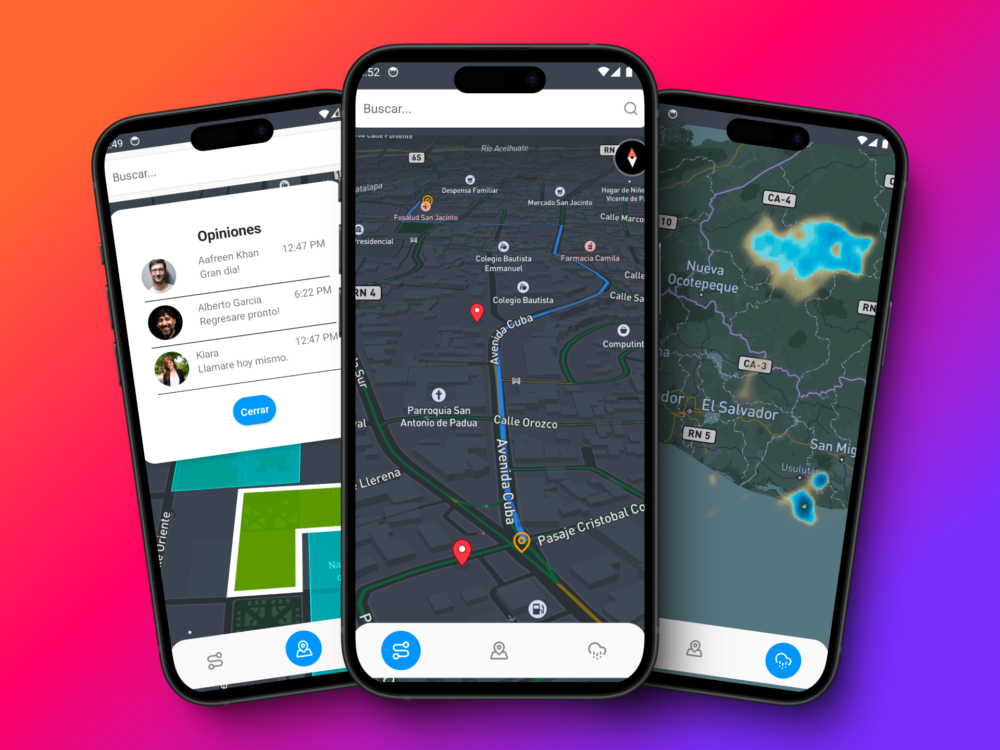

# React Native Mapbox Demo Application

This is a demo application that utilizes the Mapbox SDK to showcase the features that can be implemented in a React Native app. The application currently serves a demonstrative purpose, highlighting various functionalities of the Mapbox tool.

## Features

- **Visitor Reviews**: The first screen displays reviews from visitors to a specific location and shows other nearby locations with colored polygons.
- **Navigation**: The second screen provides a navigation interface for selecting and navigating to a destination using a search bar.
- **Precipitation Map**: The third screen is a map displaying precipitation data.



## Technologies Used


## Getting Started

Follow these instructions to set up and run the application on your local machine.

### Prerequisites

- Node.js
- React Native CLI
- Android Studio or Xcode (depending on your development environment)
- Mapbox API key

### Installation

1. Clone the repository:
   ```bash
   git clone https://github.com/sidernes/react-native-mapbox-demo.git
   cd react-native-mapbox-demo
   ```

# Getting Started

> **Note**: Make sure you have completed the [React Native - Environment Setup](https://reactnative.dev/docs/environment-setup) instructions till "Creating a new application" step, before proceeding.

## Step 1: Start the Metro Server

First, you will need to start **Metro**, the JavaScript _bundler_ that ships _with_ React Native.

To start Metro, run the following command from the _root_ of your React Native project:

```bash
# using npm
npm start

# OR using Yarn
yarn start
```

## Step 2: Start your Application

Let Metro Bundler run in its _own_ terminal. Open a _new_ terminal from the _root_ of your React Native project. Run the following command to start your _Android_ or _iOS_ app:

### For Android

```bash
# using npm
npm run android

# OR using Yarn
yarn android
```

### For iOS

```bash
# using npm
npm run ios

# OR using Yarn
yarn ios
```

If everything is set up _correctly_, you should see your new app running in your _Android Emulator_ or _iOS Simulator_ shortly provided you have set up your emulator/simulator correctly.

This is one way to run your app — you can also run it directly from within Android Studio and Xcode respectively.
